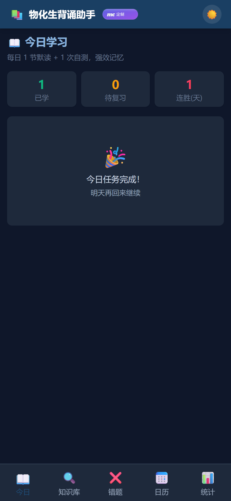
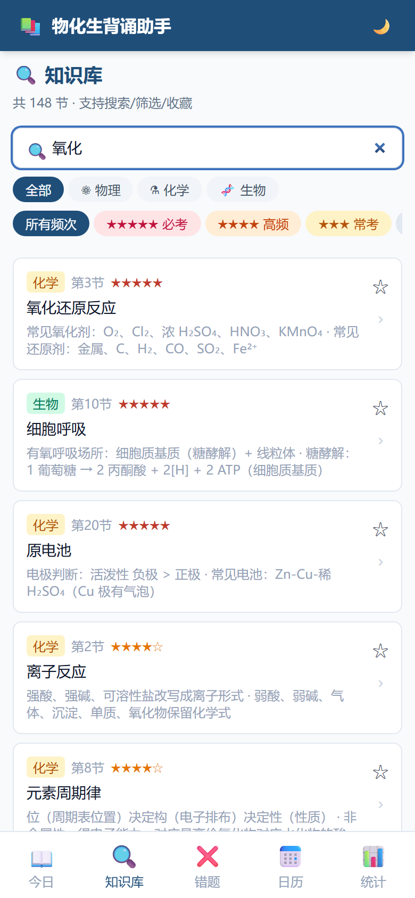
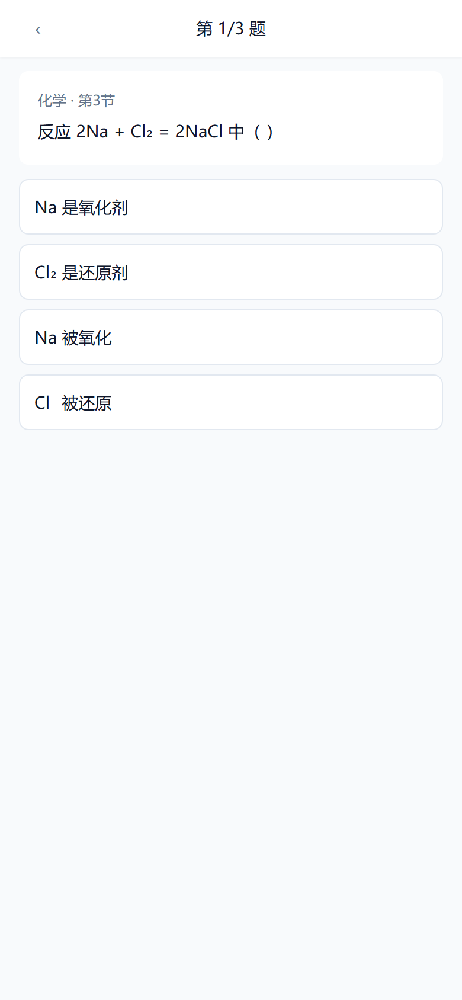
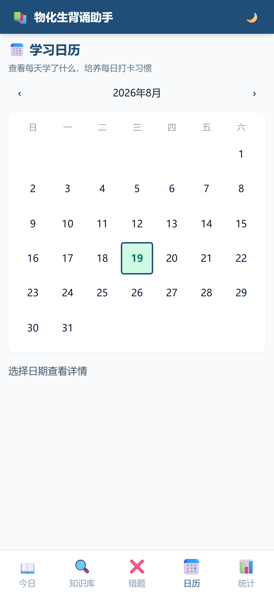

# 📚 物化生 3+1+2 学习伴侣

高考 3+1+2 物理 / 化学 / 生物三科知识速查 + 艾宾浩斯背诵 + 错题本 + 学习日历，纯前端 PWA，GitHub Pages 一键部署，手机/平板/电脑都能用。

> 🎨 **由 [mc定制](#) 设计开发** — 顶部 header 旁的紫色胶囊标，点开查看「关于」页

| 今日（深色） | 知识库 | 默写测试 | 学习日历 |
| :---: | :---: | :---: | :---: |
|  |  |  |  |

> **数据源**：148 节精选内容，覆盖物理 52 / 化学 50 / 生物 46，源自 5★必考 + 4★高频 + 3★常考 + 2★低频 + 1★偶尔选考五档频次标注。
>
> **零后端**：所有数据存浏览器 localStorage，关网也能用。

---

## ✨ 9 大核心功能

| # | 功能 | 说明 |
|---|------|------|
| 1 | **知识查询** | 三科分类 / 关键字搜索 / 频次筛选（5★→1★）/ 收藏夹 |
| 2 | **每日背诵** | 每天一个知识点卡片，按频次智能轮换，支持左右滑动切换 |
| 3 | **每日检测** | 默写题（单选/判断）+ 即时判分 + 错题自动归档 |
| 4 | **错题本** | 自动收集错题，按错误次数排序，可重做 / 标记掌握 |
| 5 | **艾宾浩斯复习** | 按 [1,2,4,7,15,30] 天间隔（4-5★用 [1,2,3,7,14]）自动推送复习 |
| 6 | **掌握度自评** | 1⭐ 陌生 → 5⭐ 精通，五档调节，系统据此调整复习权重 |
| 7 | **学习日历** | 每日打卡可视化，连续学习天数 streak 统计 |
| 8 | **数据可视化** | 总进度 / 各科掌握度 / 错题分布 / 频次分布 Chart.js 图表 |
| 9 | **PWA 离线** | Service Worker 缓存，首次加载后无网也能用，可"添加到主屏" |

---

## 📱 安装为 App（PWA）

### iPhone (Safari)
1. 用 Safari 打开站点
2. 点底部分享按钮 ↑ → **"添加到主屏幕"**
3. 主屏出现"物化生"图标，点开即用（无浏览器 UI）

### Android (Chrome / Edge)
1. 打开站点
2. 浏览器会自动弹"添加到主屏幕"提示，或点右上角菜单 → **"安装应用"**
3. 桌面/应用列表出现"物化生"图标

### 桌面 (Chrome / Edge)
1. 地址栏右侧出现 ⊕ 安装图标
2. 点"安装" → 独立窗口运行

---

## 🚀 部署到 GitHub Pages（用户名.github.io 站点）

### 一次性步骤

#### 1. 创建 GitHub 仓库
- 仓库名必须是 `你的用户名.github.io`（例如 `crashmmm.github.io`）
- 设为 **Public**
- **不要**勾选 "Add a README file"（我们已有）

#### 2. 推送代码
```bash
cd study-app
git init
git add .
git commit -m "init: 物化生学习伴侣 PWA"
git branch -M main
git remote add origin https://github.com/你的用户名/你的用户名.github.io.git
git push -u origin main
```

#### 3. 开启 GitHub Pages
- 仓库 → **Settings** → **Pages**
- Source: **Deploy from a branch**
- Branch: `main` / `(root)`
- 保存后等 1-2 分钟，访问 `https://你的用户名.github.io` 即可

#### 4. （可选）自定义域名
- Pages 设置里填 `learn.example.com`
- DNS 添加 CNAME 记录指向 `你的用户名.github.io`

---

## 🛠 本地开发

直接用静态服务器：

```bash
# Python 3
python -m http.server 8000

# 或 Node.js
npx serve .
```

打开 `http://localhost:8000`。

> ⚠️ **不要直接 file:// 打开** —— Service Worker 必须在 http(s):// 协议下才能注册。

### 清除缓存（调试时）
```js
// 浏览器控制台
navigator.serviceWorker.getRegistrations().then(r => r.forEach(x => x.unregister()));
caches.keys().then(k => k.forEach(x => caches.delete(x)));
location.reload();
```

---

## 🗂 项目结构

```
study-app/
├── index.html          # SPA 入口（5 个 tab + 模态层）
├── app.js              # 全部业务逻辑（38KB）
├── data.js             # 148 节知识数据（182KB）
├── style.css           # 自定义样式（深色 + 响应式）
├── manifest.json       # PWA 配置
├── sw.js               # Service Worker（缓存策略）
├── icons/
│   ├── icon-192.png        # PWA 标准图标
│   ├── icon-512.png        # PWA 高清图标
│   ├── icon-512-maskable.png  # Android 自适应
│   └── apple-touch-icon.png    # iOS 主屏图标
└── README.md
```

---

## 💾 数据存储

所有学习数据存在浏览器 `localStorage`：

| Key | 内容 |
|-----|------|
| `study_data_v1` | 已学 / 错题 / 收藏 / 掌握度 / 打卡记录 / 历史 |
| `theme` | 主题（light / dark） |

### 数据导出 / 导入
- App 内「统计」tab 底部有 **「导出 JSON」** / **「导入 JSON」** 按钮
- 换设备时：旧设备导出 → 新设备导入，全数据无缝迁移

---

## 🔧 技术栈

- **HTML5 + 原生 JS**（无框架，单文件即跑）
- **Tailwind CSS**（CDN，深色模式用 `class` 策略）
- **Chart.js**（CDN，数据可视化）
- **Service Worker**（本地资源 cache-first，CDN network-first）

---

## 📋 频次说明

| 星标 | 含义 | 艾宾浩斯间隔 |
|------|------|--------------|
| 5★ | 必考大题 | [1, 2, 3, 7, 14] 天 |
| 4★ | 高频考点 | [1, 2, 3, 7, 14] 天 |
| 3★ | 常考 | [1, 2, 4, 7, 15, 30] 天 |
| 2★ | 低频 | [1, 2, 4, 7, 15, 30] 天 |
| 1★ | 偶尔选考 | [1, 2, 4, 7, 15, 30] 天 |

---

## 📝 License

MIT
